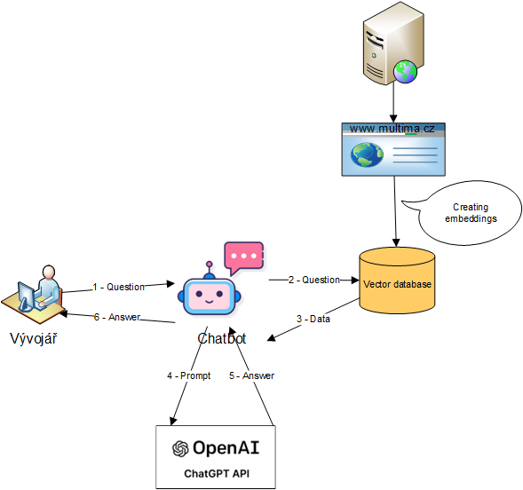
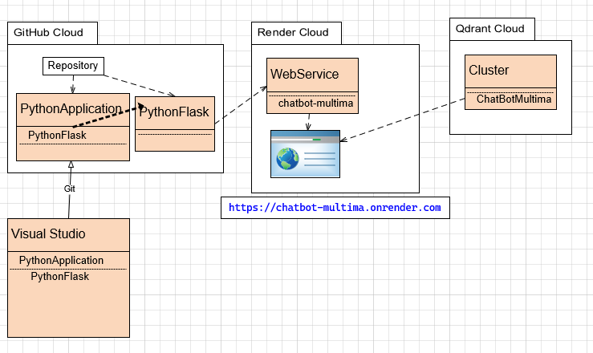
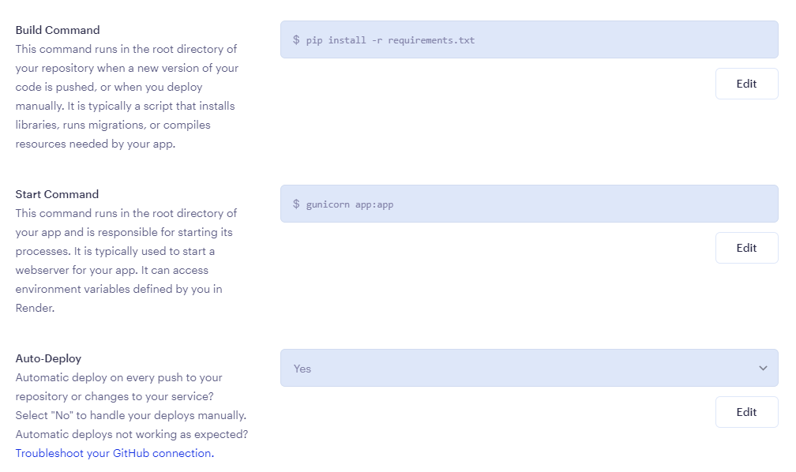
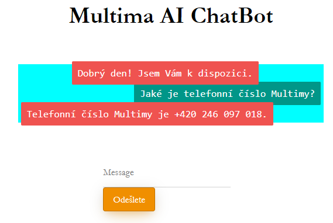

An AI Chatbot-Multima using Python and Flask


## An AI Chatbot Multima

It uses data from www.multima.cz and the embedding technique.
Embeddings are stored in the Qdrant vector database.

Chatbot works as a smart virtual AI assistant. It only supports simple query/response communication. The primary language of the data is Czech. The bot manages more than 100 world languages. Each question is analyzed and the correct language is determined. The answer is created in the language of the question.
All questions/answers are recorded in a vector database and can be used for further analysis (frequency analysis and clustering).




## Requirements (libraries)
1. Flask - framework for web application
2. OpenAI - ChatBot GPT API
3. python-dotenv - processing environment variable
4. uuid - work with uuid
5. socket - to get web user information
6. langdetect - language detection from a text
7. deep-translator - language translator
8. tiktoken - GPT2 tokenizer
9. Qdrant - Qdrant vector database
10. pandas - Dataframe framework
11. gunicorn - LINUX server for web application running
12. selenium - package is used to automate web browser interaction from Python
13. beautifulsoap - library that makes it easy to scrape information from web pages
14. LangChain - framework for developing applications powered by language models
15. docx - library for creating and updating Microsoft Word (.docx) files



Python applications are developed in Visual Studio 2022 in the PythonApplication solution. The chatbot is implemented in the PythonFlask project. The solution is synchronized with the Python GitHub repository. To use the Render cloud, the PythonFlask project must be in a separate repository. Then the PythonFlask project is copied to the PythonFlask repository. It is then used in Render cloud to create a chatbot-multima web service. This application runs on the Gunicorn application server on LINUX. For embedding, the Qdrant database is used, which runs in the Qdrant cloud on the ChatBotMultima cluster.
GitHub cloud, Render cloud and Qdrant cloud are used in free mode. Which brings restrictions on the use of resources.

**GitHub cloud**

GitHub Community Support   
Dependabot alerts  
Deployment protection rules for public repositories  
Two-factor authentication enforcement  
500 MB GitHub Packages storage  
120 GitHub Codespaces core hours per month  
15 GB GitHub Codespaces storage per month  

GitHub Actions features:  
2,000 minutes per month  
Deployment protection rules for public repositories

**Render cloud** (see https://render.com/pricing)

Free Bandwith 100 GB  
Free Build Minutes 500/month  

**Qdrant cloud** (see https://qdrant.tech/pricing/)
0,5 CPU  
1 GB memory  
20 GB disc  

memory_size = number_of_vectors * vector_dimension * 4 bytes * 1.5


## Visual Studio SetUp
1. Create solution PythonApplication
2. Create Project PythonFlask
3. Create a python virtual environment for chatbot

Run ```pip install -U Flask``` to install ```flask```  
Run ```pip install -U openai``` to install ```openai```  
Run ```pip install -U python-dotenv``` to install ```dotenv```  
Run ```pip install -U uuid``` to install ```uuid```  
Run ```pip install -U langdetect``` to install ```langdetect```  
Run ```pip install -U deep-translator``` to install ```deep-translator```  
Run ```pip install -U tiktoken``` to install ```tiktoken```  
Run ```pip install -U qdrant-client``` to install ```Qdrant```  
Run ```pip install -U pandas``` to install ```pandas```  
Run ```pip install -U gunicorn``` to install ```gunicorn```  
Run ```pip install -U langchain``` to install ```langchain```  

4. Create a python virtual environment for indexer
Run ```pip install -U beautifulsoap4``` to install ```beautifulsoap```
Run ```pip install -U selenium``` to install ```selenium``` 
Run ```pip install -U python-docx``` to install ```docx``` 

5. Create requirements.txt from virtual environment.  
6. Add solution to source Control (GitHub. Repository = PythonApplication)  
7. To expose your bot via Ngrok, run ```pip install flask-ngrok``` to install ```flask-ngrok``` Then you'll need to configure your ngrok credentials(login: email + password) Then uncomment this line ```run_with_ngrok(app) ``` and comment the last two lines ```if __name__ == "__main__": app.run() ``` Notice that ngrok is not used by default.  
8. To access your bot on localhost, go to ```http://127.0.0.1:5000/ ``` If you're on Ngrok your url will be ```some-text.ngrok.io```


## GitHub SetUp
Repository PythonApplication is created from VisualStudio.

https://github.com/vdedourek2

Create **PythonFlask** repository and copy from PythonFlask project.
Delete env. file in FlaskRepository.
Delete pywin32 from requirements.txt.

## Qdrant setup
https://cloud.qdrant.io/

Create cluster with vector database 1536 dimension in Qdrant cloud. Get URL and API_KEY.


## Render setup
https://dashboard.render.com/

Create Web service from GitHub repository PythonFlask.

SetUp environment variables:  
QDRANT_URL=  
QDRANT_API_KEY=  

FLASK_SECRET_KEY=

OPENAI_API_TYPE=azure  
OPENAI_API_BASE=  
OPENAI_API_VERSION=  
OPENAI_API_KEY=  

PYTHON_VERSION=3.11.2  



Push button Manual Deploy.

Application is accesible on https://chatbot-multima.onrender.com

When you get error
bash: gunicorn: command not found)
then you have to install gunicorn library to requirments.txt


## Access on web

https://chatbot-multima.onrender.com



## Regards,
 > [Multima a.s.](https://www.multima.cz/).
